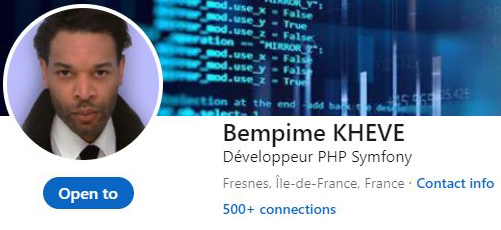
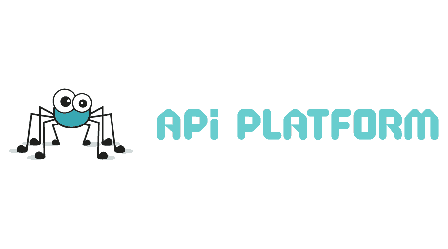

# API Platform

    

Issues...

    <table>
        <tr>
            <td>
                Demo: <a href="#">en attente</a> 
                Screencast demo 1min  
                Source: <a href="https://github.com/Juju075/api-platform">Github repository</a>  
                Source (deploy):  
                Docker image: https://hub.docker.com/r/  
            </td>
            <td>
                <em>
                </em>
                
App to deploy:

                <ul>
                <li>PHP 8.1v .</li>
                <li>Database container with a MySQL 8.0v.</li>
                </ul>
            </td>
        </tr>
        </tr>
    </table>

- Entity 
  (validator, relation, collection, lifecycle,    datetime, auto slug) OK 
  
- Normalisation groups OK 
- Http operations  OK 
- Customised operation OpenApi (Example | schema)  
- Pagination (auto) and filters OK 
- SearchFilter, properties and groups OK 
- Custom operation w controller 
- Json Schema specification 
- EventListener / PasswordEncoder OK 
- Extension 
- Use limitation for performance 
- Upload files 
  
- LOGIN JWT > check for bundle issue 
- login check  generate token 
- Voter 
- Security strategy  
  
- Audit and logs 
- Fixtures 
- Test PHP Unit 
- API Documentation (Curl) 
  
### What i learned? 

> ....
>
> [Bempime KHEVE](https://www.linkedin.com/in/bempime-kheve/) 
>
>

<a href="https://github.com/Juju075/api-platform#api-platform">Top of page</a>

# Other projects:

<ul>
    <li><a href="https://github.com/Juju075/php-framework">PHP Natif - custom framework inspired by Symfony</a></li>
    <li><a href="https://github.com/Juju075/symfony-devops">Symfony devops</a></li>
    <li><a href="https://github.com/Juju075/api-rest">ApiPlatform PHP7.4 </a></li>
    <li><a href="#">Javascript Advanced(futur project)</a></li>
    <li><a href="#">Microservices - Symfony microservices deployment on AWS (futur project)</a></li>
</ul>
 

  